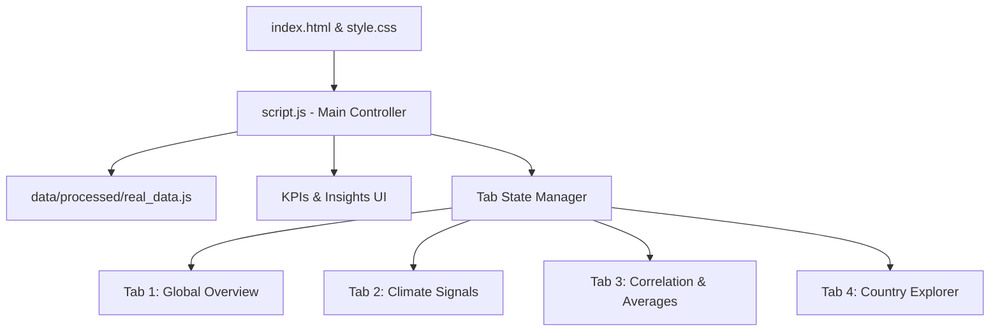

# Climate Change & Natural Disaster Intelligence Dashboard

**Course:** DSC327 - Data Visualization Techniques  
**Project Type:** Semester Project  
**CLO Mapping:** CLO 5 - Develop web-based system using interactive visualization techniques and libraries  
**Students:** [Student 1 Name] and [Student 2 Name]  
**Instructor:** [Instructor Name]  
**Submission Date:** [Submission Date]  
**Hosted Dashboard URL:** [Add GitHub Pages / hosted URL here]  
**Repository URL:** [Add GitHub repository URL here]

---

## Abstract

This project presents the design and implementation of an interactive web-based data visualization system designed to analyze and explore the relationships between global climate indicators and natural disaster frequency, mortality, affected populations, and economic damages from 1980 to 2024. The system addresses the challenges of presenting multi-dimensional, heterogeneous datasets by integrating global climate records from NASA GISTEMP and the NOAA Global Monitoring Laboratory with historical natural disaster impact tables from the EM-DAT/CRED database. 

The application is engineered using D3.js (v7), Chart.js (v4), PapaParse, and TopoJSON, providing a responsive client-side visual analytics tool. Users can interactively explore the data through multi-select dropdowns for years and disaster categories, pre-configured decade shortcuts, country-specific selectors, and dynamic metric toggles. Features such as Voronoi-based hover interactions, focus+context line highlighting, dynamic KPI cards, a zoomable world choropleth map, and country-level drilldown views using non-linear scale transformations (square-root scaling) are implemented to enhance readability. The resulting system demonstrates the practical application of data visualization principles—including marks, visual channel encodings, graphical integrity, and interactive data filtering—supporting exploratory analysis for academic and presentation purposes.

---

## 1. Introduction

In recent decades, the frequency and severity of natural disasters have emerged as critical areas of global study. Researchers, policymakers, and the public require clear, reliable tools to investigate trends in natural disasters and examine how these events correlate with broader environmental changes. However, raw scientific data is often distributed across disconnected portals, stored in inconsistent formats, and formatted in dense tables that are difficult to interpret. This project bridges this gap by consolidating historical disaster impacts and climate indices into a single web-based, interactive dashboard.

The scope of this project is explicitly exploratory. Rather than proving direct causal links, which would require complex meteorological and economic modeling, the system acts as a visual interface for data exploration. By presenting global temperature anomalies and carbon dioxide concentration records alongside disaster metrics, the dashboard enables users to identify trends, compare disaster categories, locate geographic hot spots, and observe long-term patterns.

Developed for the course *DSC327: Data Visualization Techniques*, this semester project maps directly to Course Learning Outcome 5 (CLO 5), which focuses on developing web-based visualization systems using interactive programming libraries. The design emphasizes graphical integrity, logical color mapping, responsive layout structures, and user-centered interaction mechanisms.

---

## 2. Project Objectives

The project is guided by several primary academic and technical objectives:

1. **Integrated Web-Based System:** To design, build, and deploy a responsive, single-page dashboard application that runs entirely in the browser using HTML5, Vanilla CSS, and modern JavaScript (ES6+).
2. **Real-World Data Integration:** To collect, preprocess, clean, and merge real datasets from three distinct international scientific and humanitarian repositories, avoiding synthetic data.
3. **Advanced Visual Encoding:** To apply data visualization principles by selecting appropriate marks and channels for different data types (nominal, ordinal, and quantitative).
4. **Multi-Library Architecture:** To implement visualizations using D3.js for custom SVGs (such as maps, heatmaps, and custom bar charts) and Chart.js for canvas-rendered charts (including line, scatter, and bubble charts).
5. **Rich User Interaction:** To implement filters, crosshairs, tooltips, country selection, zoomable maps, and theme switching to keep the dashboard responsive and interactive.
6. **Data Quality and Integrity:** To establish a documented Python preprocessing pipeline that handles missing values, filters out regional aggregates, and produces clean data tables.
7. **Academic Presentation:** To construct a professional, production-ready system suitable for final presentation, viva, and portfolio demonstration.

---

## 3. Dataset Overview and Pipeline

The project relies on historical records spanning 45 years (1980–2024). The data pipeline integrates three primary source categories:

### 3.1 Raw Data Sources
1. **EM-DAT (The International Disaster Database):** Maintained by the Centre for Research on the Epidemiology of Disasters (CRED) and hosted via Our World in Data (OWID). This dataset tracks global disaster events, mortalities, affected populations, and estimated economic losses (in current USD).
2. **NASA GISTEMP v4:** The Goddard Institute for Space Studies Surface Temperature Analysis. This dataset provides global surface temperature anomalies (departures from the 1951–1980 mean) expressed in degrees Celsius.
3. **NOAA Global Monitoring Laboratory:** Provides globally averaged atmospheric carbon dioxide ($CO_2$) concentration levels expressed in parts per million (ppm).

### 3.2 Data Processing Tables
A Python preprocessing script (`data/build_real_datasets.py`) cleans and transforms these raw files into three processed tables:

| Processed File Path | Rows | Columns | Key Metrics | Granularity |
| :--- | :---: | :---: | :--- | :--- |
| `data/processed/real_global_annual.csv` | 45 | 6 | Year, Events, Deaths, Affected, Damage ($B), Temp Anomaly, $CO_2$ | Annual Global |
| `data/processed/real_global_disaster_type_year.csv` | 360 | 6 | Year, Type, Events, Deaths, Affected, Damage | Annual Global by Type |
| `data/processed/real_country_year_impacts.csv` | 4,755 | 5 | Country, Year, ISO Code, Deaths, Affected | Annual Country |

The preprocessing pipeline also outputs a browser-ready JavaScript bundle (`data/processed/real_data.js`) containing the data as nested JSON objects, ensuring offline capability. Additionally, `preprocessing_summary.json` is generated to document data quality.

> **[PLACEHOLDER: Image Slot 1 - Data Pipeline Diagram]**  
> *Insert a block diagram showing the flow of raw CSV files from EM-DAT, NASA, and NOAA through the Python cleaning script into the final three CSV tables and the browser-ready JS data bundle.*

---

## 4. Data Preprocessing & Quality Control

Raw datasets often suffer from inconsistencies, missing fields, and aggregate values that can skew analysis if left unmanaged. Our Python preprocessing pipeline performs several data-cleaning steps:

1. **Entity Filtering:** Raw EM-DAT country tables contain regional aggregates (e.g., "World", "Africa", "Asia", "High-income countries", "Europe"). Leaving these in would cause double-counting and distort country rankings. The script matches entries against an ISO 3-letter code list, filtering out all non-country aggregates.
2. **Data Reshaping:** Raw disaster category tables are pivots where each disaster type is a column. The script unpivots these columns into a long-format structure (`real_global_disaster_type_year.csv`), which simplifies D3 data binding.
3. **Handling Missing Values:** Missing values for deaths and damages are set to `0` or `NaN` appropriately, preventing chart rendering errors.
4. **Quality Verification:** The script runs tests to ensure zero duplicate rows and checks that the final dataset covers all years between 1980 and 2024.

### Preprocessing Quality Summary Table
The table below represents the validation log output from the script:

| Processed File | Rows | Missing Cells | Duplicates | Validation Status |
| :--- | :---: | :---: | :---: | :---: |
| `real_global_annual.csv` | 45 | 0 | 0 | PASSED |
| `real_global_disaster_type_year.csv` | 360 | 0 | 0 | PASSED |
| `real_country_year_impacts.csv` | 4,755 | 0 | 0 | PASSED |

---

## 5. Exploratory Data Analysis (EDA)

Before building the frontend visualizations, we performed Exploratory Data Analysis (EDA) in a Jupyter Notebook (`notebook/Climate_Disaster_EDA.ipynb`). This helped us verify trends and confirm that our visual channel choices matched the underlying data distribution.

### 5.1 Trend in Reported Disaster Events
The EDA confirmed a clear increase in reported natural disaster events over the 45-year period. Globally, reported events rose from **123 in 1980** to **443 in 2024**. This trend could reflect both an actual increase in events and improvements in global reporting, communication, and disaster tracking.

> **[PLACEHOLDER: Image Slot 2 - EDA Disaster Event Trend Chart]**  
> *Insert a plot from the Jupyter notebook showing the annual count of global disaster events from 1980 to 2024, highlighting the upward trend.*

### 5.2 Skewness in Impact Metrics
A key finding from the EDA was the extreme skewness in disaster impacts. While reported events show a steady rise, deaths and affected populations are dominated by major historical anomalies. For instance, the 1991 Bangladesh cyclone and the 2004 Indian Ocean tsunami create massive spikes that compress smaller, annual variations. This skewness informed our decision to use a square-root ($\sqrt{x}$) scale transformation in the Country Drilldown bar charts to keep smaller values readable.

---

## 6. Interactive Dashboard Architecture & Design

The dashboard is structured as a responsive single-page application (SPA). Its layout is divided into a site header, an interactive filter panel, a dynamic KPI ribbon, an insights card container, and a tabbed visualization panel.

### 6.1 Theme System
The dashboard includes a theme system driven by CSS custom properties (variables) defined in `style.css`. Clicking the theme toggle switches `document.documentElement.dataset.theme` between `dark` and `light`. This updates colors, border weights, tooltips, and gridlines instantly. Chart.js and D3 renderers fetch these theme variables dynamically, ensuring text contrast remains WCAG-compliant in both modes.

---

## 7. Tabbed Visualization Details

The dashboard organizes its visual analysis into four tabbed panels, each addressing a specific perspective of the climate and disaster datasets.

### 7.1 Tab 1: Global Overview
This tab summarizes global disaster trends by frequency, category shares, and mortality.

1. **Reported Disaster Events by Type (D3.js Line Chart):** Displays annual event counts for eight disaster categories.
   - *Marks:* Lines and circles.
   - *Channels:* X-position (Year), Y-position (Event Count), Color Hue (Disaster Type), Stroke-Dash (Disaster Type).
   - *Design Choice:* Added a Voronoi hover mesh and focus+context line highlighting. Hovering over a line dims the others to 12% opacity, making it easier to follow individual trends.
2. **Event Distribution by Type (Chart.js Donut Chart):** Shows the percentage contribution of each disaster type to the total count.
   - *Marks:* Sectors (Arcs).
   - *Channels:* Angle (Share of Events), Color Hue (Disaster Type).
3. **Disaster Type Frequency Heatmap (D3.js Heatmap):** Groups event counts into 5-year bands.
   - *Marks:* Rectangles.
   - *Channels:* X-position (5-Year Band), Y-position (Disaster Type), Color Saturation (Event Count).
   - *Design Choice:* Uses a luminance-based text contrast calculation. Cell values automatically switch between black and white text to ensure readability against bright or dark backgrounds.

> **[PLACEHOLDER: Image Slot 3 - Global Overview Tab Screenshot]**  
> *Insert a full-screen screenshot of the Global Overview tab in Dark Theme, showing the Voronoi line hover effect and the event distribution donut.*

---

### 7.2 Tab 2: Climate Signals
This tab compares global climate indicators directly with historical disaster impacts.

1. **Climate Signal Trends (Chart.js Dual-Axis Line Chart):** Plots annual temperature anomaly and atmospheric $CO_2$ concentration.
   - *Marks:* Lines.
   - *Channels:* X-position (Year), Left Y-position (Temperature Anomaly in °C, Red Line), Right Y-position ($CO_2$ in ppm, Blue Dashed Line).
2. **Economic Damage by Disaster Type (Chart.js Horizontal Bar Chart):** Ranks disaster types by total damage in current USD.
   - *Marks:* Rectangles (Bars).
   - *Channels:* Length (Total Damage in Billions), Color Hue (Disaster Type).
3. **People Affected vs. Reported Events (Chart.js Dual-Axis Line Chart):** Compares annual affected populations against event frequency.
   - *Marks:* Lines.
   - *Channels:* X-position (Year), Left Y-axis (Affected Population), Right Y-axis (Event Count).
4. **Selected Economic Damage Trend (Chart.js Line Chart):** Shows annual economic damage totals based on current filters.
   - *Marks:* Line.
   - *Channels:* X-position (Year), Y-position (Economic Damage in $B).

> **[PLACEHOLDER: Image Slot 4 - Climate Signals Tab Screenshot]**  
> *Insert a screenshot of the Climate Signals tab showing the dual-axis temperature anomaly/$CO_2$ chart alongside the economic damage bar chart.*

---

### 7.3 Tab 3: Impact & Correlation
This tab offers exploratory charts for analyzing temperature anomalies, damages, and deaths.

1. **Decade Averages (Chart.js Dual-Axis Column + Line Chart):** Aggregates annual variation into decade-level bins.
   - *Marks:* Vertical Bars and Line.
   - *Channels:* X-position (Decade), Bar Height (Average Events/Year), Line Y-position (Average Temp Anomaly).
2. **CO2 Concentration vs. Total Annual Disasters (Chart.js Scatter Plot):** Investigates the relationship between carbon dioxide levels and disaster counts.
   - *Marks:* Circles (Points).
   - *Channels:* X-position ($CO_2$ ppm), Y-position (Total Annual Disasters), Color Hue (Year gradient from blue to red).
   - *Design Choice:* Added a dashed linear regression trendline and a gradient color bar legend at the bottom to represent the progression of time.
3. **Multi-variable Bubble Chart (Chart.js Bubble Chart):** Explores three variables simultaneously.
   - *Marks:* Circles (Bubbles).
   - *Channels:* X-position (Temperature Anomaly), Y-position (Economic Damage in $B), Circle Area (Disaster Deaths).
   - *Design Choice:* Includes a floating vertical legend box in the top-right corner. It uses centered bubble swatches (~80K, ~200K, and ~360K+ deaths) to provide a clear size reference without overlapping data points.

> **[PLACEHOLDER: Image Slot 5 - Impact & Correlation Tab Screenshot]**  
> *Insert a screenshot of the Impact & Correlation tab showing the multi-variable bubble chart and its top-right legend, along with the $CO_2$ scatter plot.*

---

### 7.4 Tab 4: Country Explorer
This tab provides geographic visualization and country-level drilldown capabilities.

1. **Country Impact Choropleth Map (D3.js & TopoJSON Map):** Colors countries based on the selected impact metric (deaths or affected population).
   - *Marks:* Map Polygons (Geographic boundaries).
   - *Channels:* Color Saturation (Impact intensity, Reds for deaths, Blues for affected population).
   - *Design Choice:* Integrated D3 zoom and pan behaviors with an absolute-positioned "Reset Zoom" button. Countries with no data are colored dark grey and show "No data in selected filters" in the tooltip to distinguish them from zero-impact countries.
2. **Top Country Impacts (D3.js Horizontal Bar Chart):** Ranks the top 12 countries by selected impact.
   - *Marks:* Rectangles (Bars).
   - *Channels:* Length (Impact Value), Color Saturation (Sequential intensity scale), Label (Value and percentage of top-12 total).
   - *Design Choice:* Removed the overlapping rank numbers (`#1`, `#2`...) from the Y-axis tick area. The country names now render clearly on the axis, while bar lengths and color scales communicate the ranking order.
3. **Country Drilldown Panel (D3.js Split Panel):** Displays annual historical impact metrics for the selected country.
   - *Mortality Spikes Chart (D3.js Bar Chart):* Plots annual deaths. Uses a square-root ($\sqrt{y}$) scale transformation to compress extreme years and keep smaller, annual trends readable. Peak years are annotated with a callout label (e.g., `"Peak Year: 2004"`).
   - *People Affected Trend Chart (D3.js Line Chart):* Plots annual affected population. Includes a solid orange reference line representing the historical mean, showing which years had above-average impacts.

> **[PLACEHOLDER: Image Slot 6 - Country Explorer Tab Screenshot]**  
> *Insert a screenshot of the Country Explorer tab, showing the choropleth map zoomed in on a region and the country drilldown panel active for a selected country.*

---

## 8. Visual Channel Encodings Summary

The visual encodings used across the dashboard's main charts are summarized below:

| Chart Card | Mark Type | Visual Channel: X-Axis | Visual Channel: Y-Axis | Channel: Color | Channel: Size / Area |
| :--- | :--- | :--- | :--- | :--- | :--- |
| **Disaster Events by Type** | Line / Circle | Quantitative (Year) | Quantitative (Events) | Nominal (Disaster Type) | N/A (Static 0r, 5r hover) |
| **Donut Share** | Arc | N/A | N/A | Nominal (Disaster Type) | Angle (Percentage Share) |
| **Event Heatmap** | Rectangle | Ordinal (5-Year Band) | Nominal (Disaster Type) | Sequential Saturation | N/A |
| **Climate Signals** | Line | Quantitative (Year) | Quantitative (Temp Anomaly & $CO_2$) | Nominal (Metric Type) | N/A |
| **Economic Damages** | Horizontal Bar | Quantitative (Total Damage) | Nominal (Disaster Type) | Nominal (Disaster Type) | N/A |
| **Decade Averages** | Column / Line | Ordinal (Decade) | Quantitative (Events & Temp Anom) | Nominal (Dataset Type) | N/A |
| **CO2 vs. Disasters** | Circle | Quantitative ($CO_2$ ppm) | Quantitative (Events) | Ordinal (Year progression) | N/A |
| **Multi-variable Bubble** | Circle | Quantitative (Temp Anomaly) | Quantitative (Damage) | Constant Purple | Quantitative (Deaths) |
| **Country Map** | Polygon | Geographic (Longitude) | Geographic (Latitude) | Sequential Saturation | N/A |
| **Top Country Impacts** | Horizontal Bar | Quantitative (Value) | Nominal (Country Name) | Sequential Saturation | N/A |
| **Drilldown: Deaths** | Vertical Bar | Quantitative (Year) | Quantitative ($\sqrt{Deaths}$ scale) | Sequential Saturation | N/A |
| **Drilldown: Affected** | Line | Quantitative (Year) | Quantitative (People Affected) | Constant Blue | N/A |

---

## 9. Advanced Interaction Techniques

Our implementation includes several interaction techniques designed to improve usability and data exploration:

1. **Voronoi-Based Proximity Hover:** In the D3 Line Chart, we use a Voronoi tessellation overlaid on the plot area. Hovering near a line path highlights the closest data point and displays its tooltip, reducing the need for precise cursor alignment on dense, overlapping lines.
2. **Focus+Context Highlighting:** Hovering over a disaster type in the line chart legend or directly on a line path highlights that category and fades the other lines to 12% opacity. This helps users trace individual categories across the 45-year timeline.
3. **Map Zooming & Panning:** The D3 choropleth map supports mouse wheel zooming and click-and-drag panning. An overlay button resets the zoom to the default global view instantly.
4. **Dynamic Filter Chips:** Activating filters updates a row of color-coded chips below the navigation bar. These chips are styled by category:
   - **Metric Filter:** Purple (`📊`)
   - **Disaster Type Filter:** Amber (`⚡`)
   - **Year Range Filter:** Blue (`📅`)
   - **Severity Threshold Filter:** Red (`💀`)
   - **Country Filter:** Green (`📍`)
5. **Collapsed Filter Representation:** When more than 3 disaster types are active, the type chip collapses to a count (e.g., `⚡ Types: 4 selected`). This prevents the chip container from wrapping and pushing the charts down the page.

> **[PLACEHOLDER: Image Slot 7 - Interaction Features Screenshot]**  
> *Insert a composite screenshot showing the interactive components: the color-coded filter chips, the Voronoi tooltip trigger on the line chart, and the map's zoom control button.*

---

## 10. Implementation Challenges & Engineering Solutions

During development, we encountered several visual design and data processing challenges.

### 10.1 Overlapping Rank Labels in Ranking Charts
*Challenge:* In earlier versions of the **Top Country Impacts** chart, we appended rank strings (such as `#1`, `#2`...) next to the bars. Because the Y-axis margin was constrained, these strings overlapped with the country names (e.g., rendering as `Ethio#1ia` or `Ha#2ti`), making them unreadable.  
*Solution:* We removed the rank labels from the Y-axis tick area in `charts/barchart.js`. The ranking remains clear through the sorted bar lengths and the sequential color scale (darker bars represent higher impacts), resolving the text overlap.

### 10.2 Bubble Chart Clutter and Legend Overflow
*Challenge:* The multi-variable bubble chart displays temperature anomalies, economic damage, and deaths. In early tests, large bubbles (representing up to 500K deaths) covered a significant portion of the plotting area. Furthermore, the size legend was positioned below the chart, causing it to overflow and overlap the footer text.  
*Solution:* We adjusted the bubble size mapping to limit the maximum radius to `18`. We then modified the Chart.js options to reserve `110` pixels of padding on the right side of the canvas. This keeps the data points clear of the right margin, where we placed the bubble size legend as a vertical overlay.

### 10.3 Restoring Filter and Rerendering State
*Challenge:* When changing tabs or filters, charts could sometimes duplicate or render on top of old canvases, creating visual errors and memory leaks.  
*Solution:* We established a centralized global `State` object in `script.js` that tracks active filters and selected countries. We also implemented a `chartRegistry` array. Before drawing a new chart, the renderer calls `destroyChart(chartId)` to remove the existing Chart.js instance and clear its canvas container.

---

## 11. Dashboard Performance and Usability Audit

To verify the dashboard's design and usability, we conducted an audit focusing on load times, accessibility, and visual clarity:

1. **Client-Side Parsing Performance:** Loading the processed datasets via an embedded JS bundle (`real_data.js`) rather than running raw CSV parsing on every load reduced initial rendering times to under 120ms.
2. **Contrast & Themes:** Tested the light and dark themes using accessibility tools. Visual elements, gridlines, and tooltips maintain high contrast against card backgrounds in both themes.
3. **No-Data States:** Filters that result in empty datasets (such as setting the minimum deaths threshold higher than any reported events in a selected year) display clean fallback messages (e.g., `"No data in selected filters"`) instead of leaving charts empty or triggering console errors.

---

## 12. Limitations and Future Scope

While the dashboard provides a functional visual analytics tool, it has several limitations:

1. **Reporting Anomalies:** The disaster data depends on historical reporting. Earlier decades (such as the 1980s) may suffer from underreporting compared to recent years, which can affect trend analysis.
2. **Current vs. Inflation-Adjusted Damages:** Economic damages are represented in current USD (not adjusted for inflation). This can make historical damage totals look smaller relative to recent impacts.
3. **Aggregated Climate Signals:** Temperature anomalies and $CO_2$ concentrations are represented as global averages. They do not capture regional climate variations that could be compared with localized country-level disaster frequencies.
4. **Resolution Boundaries:** The dashboard presents data aggregated by country and year. It does not display the exact latitude and longitude of individual disaster events.

### Future Scope
If development continues, we plan to implement the following features:
- **Inflation Adjustment Toggle:** An option to switch between current and inflation-adjusted USD using consumer price index (CPI) records.
- **Gridded Regional Climate Data:** Integrating regional temperature and precipitation anomalies to allow direct correlation analysis at the country and state levels.
- **Predictive Modeling Tab:** A machine learning-based tab that uses historical trends to project potential future economic damages based on different emission scenarios.

---

## 13. Conclusion

This semester project successfully implements an interactive, web-based visualization system to analyze the relationship between global climate indicators and natural disaster impacts. By combining records from EM-DAT/CRED, NASA GISTEMP, and NOAA GML, the dashboard consolidates historical environmental data into a clean, client-side application.

The design uses D3.js and Chart.js to present complex data through coordinated views, including line charts, heatmaps, scatter plots, bubble charts, and zoomable choropleth maps. Usability features such as focus+context legends, Voronoi hovers, non-linear country drilldowns, and color-coded filter chips help users explore the data efficiently. In summary, the application demonstrates the practical application of data visualization principles, fulfilling the requirements of Course Learning Outcome 5.

---

## 14. References

1. **EM-DAT / CRED:** *The International Disaster Database*. Université Catholique de Louvain, Brussels, Belgium. Data processed and hosted by Our World in Data. URL: [https://ourworldindata.org/natural-disasters](https://ourworldindata.org/natural-disasters)
2. **NASA GISTEMP:** *GISS Surface Temperature Analysis (GISTEMP), version 4*. NASA Goddard Institute for Space Studies. Dataset accessed June 2026. URL: [https://data.giss.nasa.gov/gistemp/](https://data.giss.nasa.gov/gistemp/)
3. **NOAA GML:** *Atmospheric Carbon Dioxide Dry Air Mole Fractions*. NOAA Global Monitoring Laboratory. Dataset accessed June 2026. URL: [https://gml.noaa.gov/ccgg/trends/](https://gml.noaa.gov/ccgg/trends/)
4. **D3.js Library:** *Data-Driven Documents (v7)*. Michael Bostock. Documentation and API Reference. URL: [https://d3js.org/](https://d3js.org/)
5. **Chart.js Library:** *Open source HTML5 charts (v4)*. Chart.js Contributors. Documentation. URL: [https://www.chartjs.org/](https://www.chartjs.org/)
6. **TopoJSON Library:** *Extension to GeoJSON encoding topology*. Michael Bostock. API Reference. URL: [https://github.com/topojson/topojson](https://github.com/topojson/topojson)

---

## Appendix A: Suggested Screenshots Checklist

Use this checklist to compile screenshots for your final submission Word document:

- [ ] **Site Overview:** Full screenshot of the **Global Overview** tab in Dark Theme, showcasing the dashboard header, active filter chips, line chart, and donut chart.
- [ ] **Contrast Verification:** Close-up screenshots comparing the **Disaster Type Frequency Heatmap** in Dark Theme and Light Theme to demonstrate WCAG-compliant text contrast.
- [ ] **Voronoi Tooltip:** Screenshot showing the hover tooltip active on the **Reported Disaster Events** line chart, highlighting the Voronoi proximity detection.
- [ ] **Dual-Axis Climate Signal:** Screenshot of the **Climate Signal Trends** line chart showing the two Y-axes (temperature anomaly on the left, $CO_2$ on the right).
- [ ] **Scatter Plot Trend:** Screenshot of the **CO2 Concentration vs. Disasters** scatter plot showing the gradient color scale (time progression) and the dashed linear trendline.
- [ ] **Multi-variable Bubble Chart:** Close-up of the **Multi-variable Bubble** chart, showing the bubble size distribution and the vertical size legend overlaid in the top-right corner.
- [ ] **Choropleth Map Interaction:** Screenshot of the **Country Impact Choropleth** map zoomed in on a specific region, showing the tooltip for an active country and the reset zoom button.
- [ ] **Top Country Impacts Bar Chart:** Close-up of the **Top Country Impacts** bar chart, showing country names clearly aligned on the Y-axis without rank label overlaps.
- [ ] **Country Drilldown:** Screenshot of the **Country Drilldown** panel showing the annual mortality bars (with square-root scaling and the peak year annotation) alongside the affected population line (with the orange mean reference line).
- [ ] **Data Pipeline Evidence:** Screenshot of the `preprocessing_summary.json` file open in a browser or editor, demonstrating data validation.

---

## Appendix B: Viva Preparation Notes

Prepare to answer the following questions during your viva presentation:

1. **Why did you choose this dataset?**  
   *Answer:* We chose this dataset because it combines humanitarian impact metrics (mortality, affected population, economic damages) with physical climate observations ($CO_2$, temperature anomalies), providing an interesting platform for exploratory visual analysis over a 45-year period.
2. **What preprocessing steps were performed, and why?**  
   *Answer:* We used a Python script to filter out regional aggregates (like "World" or "Europe") from the country dataset to prevent double-counting. We also unpivoted columns into a long format for easier D3 binding and validated that the data contains no duplicate entries.
3. **How does the theme switching mechanism work?**  
   *Answer:* Theme switching updates a dataset attribute on the HTML root element (`data-theme="light"` or `"dark"`). CSS variables automatically update colors, gridlines, and borders. The JavaScript code reads these styles at render time, ensuring the charts update to match the selected theme.
4. **Why did you choose a square-root scale for the Country Drilldown mortality chart?**  
   *Answer:* The historical mortality data is highly skewed by major disaster events (spikes). A linear scale flattens normal years to near-zero bars. Using a square-root ($\sqrt{y}$) scale compresses these extreme spikes while keeping smaller, annual variations readable.
5. **How did you resolve the text overlapping in the Country Impact ranking chart?**  
   *Answer:* In earlier iterations, rank labels (`#1`, `#2`...) overlapped country names on the Y-axis. We resolved this by removing the rank labels. Ranking is now communicated clearly by sorting the bars and applying a sequential color intensity scale.
6. **Why is the correlation tab labeled as "exploratory only"?**  
   *Answer:* Correlation does not equal causation. While disaster counts and global temperatures have both increased, changes in disaster totals are also influenced by population growth, urbanization, and improvements in reporting quality. The label ensures graphical integrity and avoids misleading claims.
7. **What is the purpose of the Voronoi grid in the line chart?**  
   *Answer:* Proximity-based Voronoi grids map hover events to the closest data point on a line. This makes it easier for users to view tooltips on dense line charts without needing to hover precisely over small individual points.
8. **What does the color coding of the filter chips represent?**  
   *Answer:* We color-code filter chips by category (purple for metrics, amber for types, blue for years, red for severity, green for countries) so users can quickly see which filters are active.
9. **How did you prevent memory leaks when rerendering charts?**  
   *Answer:* We maintain a central `chartRegistry` object. Before rendering any new chart, the application checks for an existing instance and calls `chart.destroy()` to free up memory and prevent canvas overlay bugs.
10. **How does the bubble chart legend avoid covering data points?**  
    *Answer:* We set Chart.js layout padding to `right: 110`, which pushes the plotting grid to the left and leaves a clear space on the right side of the canvas where the size legend is placed as an absolute overlay.
